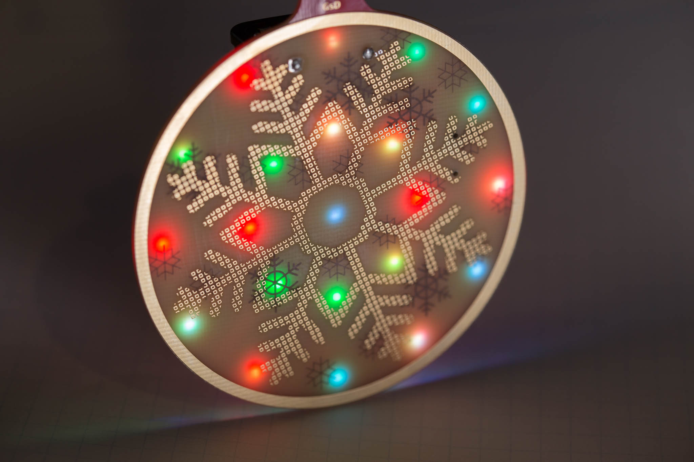
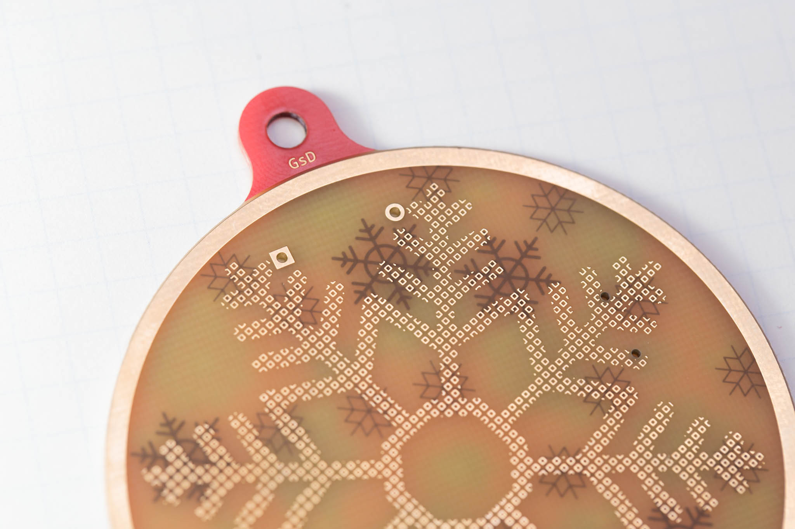
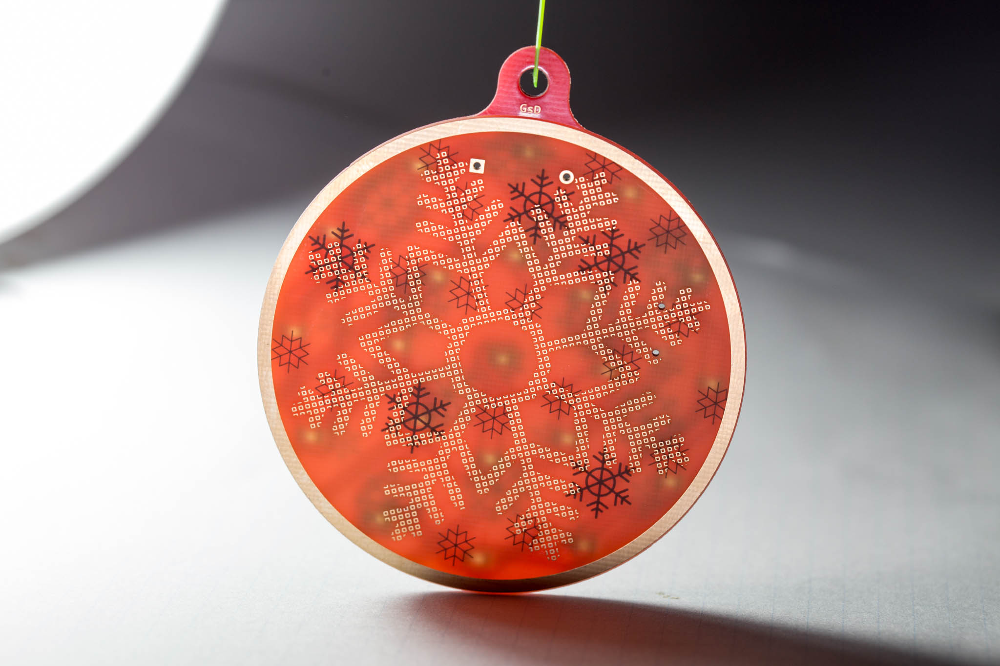
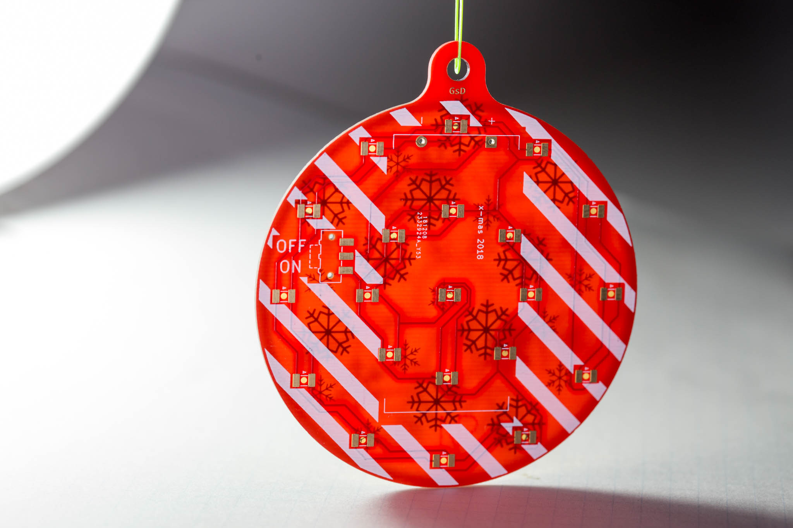

# xmas-led

A Simple and easy to build Christmas ornament.
Designed and built in KiCad

Want to build or design your own? More info and instructions here: https://www.hackster.io/gregdavill/led-christmas-decorative-pcb-510e12

## Project Features:
 + ENIG plating
 + 4 Layer to create multiple layers
 + Uses simple to use colour fading LEDs

## More Photos

